# Team Implementation Report
Over the weeks we created algorithms, described in the header below which allowed us to visualise the code to build. We used python to implement data from the NHS website to forecast the results over the given weeks. We imported statics from the NHS website which updates itself. We plotted the following keys against weeks:
* New cases
* New Deaths
* New cases and deaths
* Cumulative Cases 
* Cumulative deaths 
* Cumulative cases and deaths

## Technical Diagrams
A UML class diagram for our program is shown below:

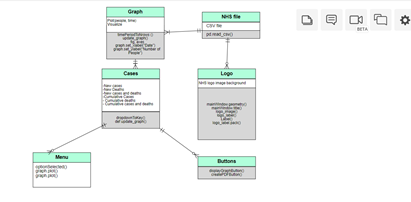

## Technical Description
### Functions of Our Code
We used many functions of our code which are as follows:
1. Linear_regression
2. support_vector_machine_prediction
3. logistic_prediction
4. dates_addition
5. linear_prediction
6. get_file
7. update_graph
8. create_pdf

#### Linear_regression ####
The image below shows the linear regression function.
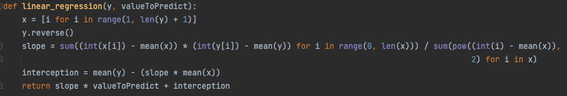
The linear regression function is called whenever the user has selected linear regression when updating the graph.

#### support_vector_machine_prediction ####
The image below shows the support vector prediction function.
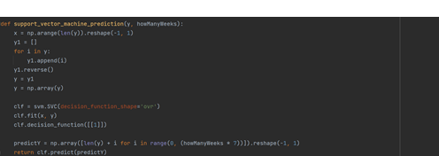
This function is called when the user selects the support vector machine prediction model and updates the graph. 

#### logistic_prediction ####
The image below shows the logistic prediction function.
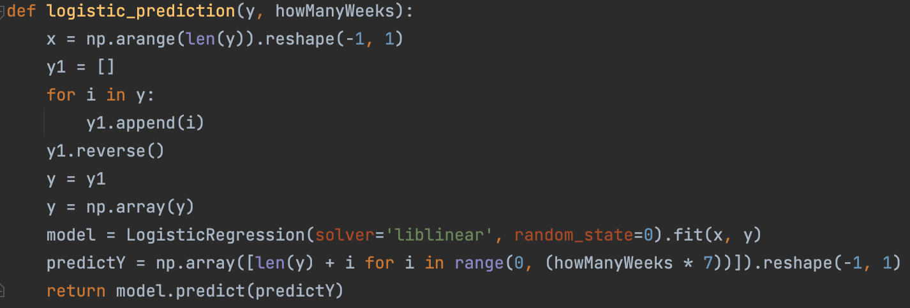
This function is called when the user selects the logistic prediction model and updates the graph. 

#### dates_addition ####
The image below shows the dates addition function.
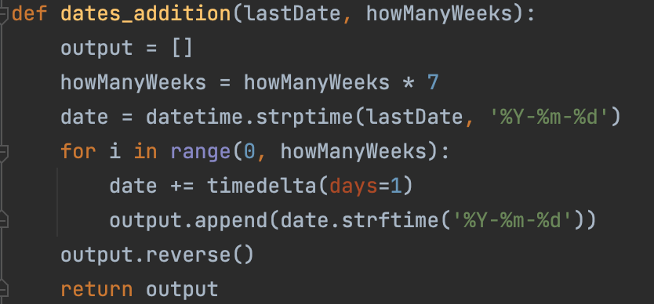
This function displays the date and weeks of the model 

#### linear_prediction ####
The image below shows the linear prediction function.
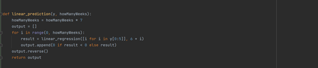
This function is called when the user selects the linear prediction model and updates the graph. 

#### get_file ####
The image below shows the get file function.
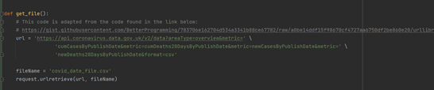
This function is called at the start of running the program in order to download the latest version of the data file from the NHS website.

#### update_graph ####
The image below shows part of the update graph function.
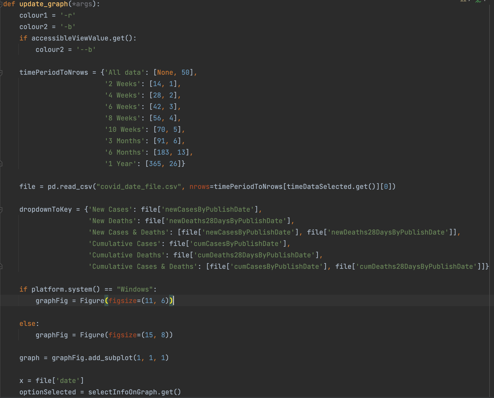
This function is called when the user clicks the update graph button. When the button is pressed the graph is generated and displayed on the GUI using the options selected by the user.

#### create_pdf ####
The image below is the create_pdf function
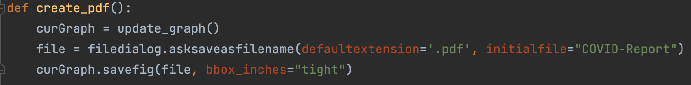
This function creates a pdf file containing the current graph. A save as window is displayed when the user press the create PDF button which allows the user to choose the name and save location of the PDF created.

### Other Key Information about the Code
The main function of our code is fairly simple. First the get_file function is called in order to update the file. Next the tkinter GUI window is created with a fixed size and is given a title and a header is added to the GUI window containing the NHS logo. After that it is just adding buttons, dropdowns and checkboxes to the main window an adding any necessary options or variable calls to them.

### Features We are Proud Of
We are proud of the highest and lowest week feature because it is a lot more use friendly for the user because it allows them to see key data quicker. An example is shown below.

Another feature we are proud of is the amount of options the user has as they allow the user to really tailor make their graph.
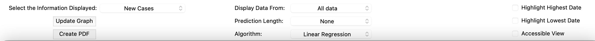

## Algorithms and Data Structures
One algorithm we used is Linear regression shown below:

One data structure we used was a map. One example of where we used this was in the update_graph function to determine the number of rows of the file that needed to be read based on the option selected by the user. An image of this map is shown below:
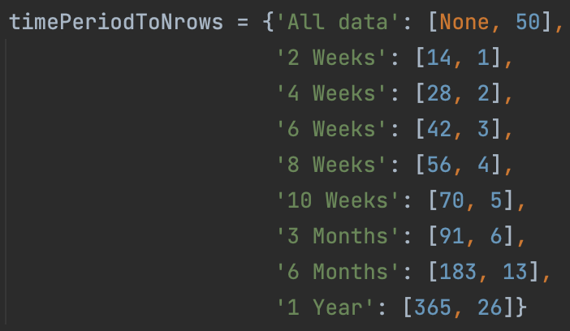

## Imported Libraries
* platform - Used to check what operating system the user is using, as otherwise the scaling for the GUI may not be correct.
* Tkinter - Used for creating the GUI
* Tkinter filedialog - Used for the save as feature of the create PDF function.
* Pandas - Used for the reading of the file, as well as manipulation of the data set depending on the output/functionality required.
* PIL import ImageTk, Image - Used to display the NHS logo in the GUI.
* Various matplotlib imports - Used to create the graphs as well as adding them to the GUI.
* mean - Used to get the mean value. Used in the prediction model functions
* datetime - Used in various prediction model function to increment the date (x-axis)
* re - Used for regular expressions
* request - Used for retrieving the COVID data file via the url.
* sklearn imports - Used for the prediction model functions.

## Known Issues
Issues that we faced included the NHS website not working at a certain time. Around 6pm the system is down which affects our product during that time. This would mean the user has to be made aware of this.