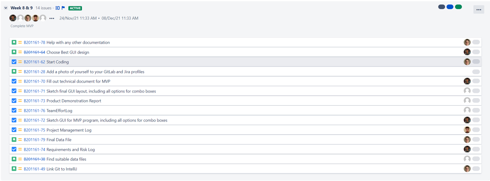

# Project Management Log
## Project management discussion

the group is currently working with a great efficiency. Each member has their role but they are also capable of helping those with different tasks thanks to our shared general knowledge of the tasks to be completed.

During scrum meetings, the group is able to make face to face contact and ask questions that they may have to their fellow group members and the face to face contact allows for swift assisstance if need be.

For communication outside of scrum meetings, although the group has multiple forms of communication for the discussion of the work and there have been minimal issues thus far, the communication may struggle if there are issues with the device used for communication. 
Depending on the type of issue, be it software or hardware, this will influence the time needed to fix the issue.
for example a lack of internet connection can be solved as simply as restarting drivers, but a fault within hardware may require replacement parts.

*If standup meetings were used, then include a Jira link, and discuss their effectiveness.*

## Sprint Burndown Charts

*In this section include a screenshot of a sprint-burndown chart for each of your completed sprints.*

*For each sprint, include links to the standup meetings (recorded on Jira, hopefully) associated with each sprint.*

## Burndown-Charts Discussion
*Add a discussion of what the burndown charts indicate, and how your team might improve their velocity / estimation ability in future sprints.*

## Product Backlog

## Other Areas
*If your team has anything else they want to demonstrate, e.g. advanced project management tools, reporting graphs with suitable explanation and interpretation, advanced use of Jira (e.g. issue links, epics, versions), or continuous integration tools, then include a summary here.*
 
