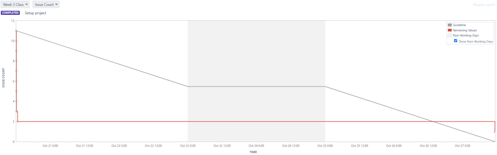
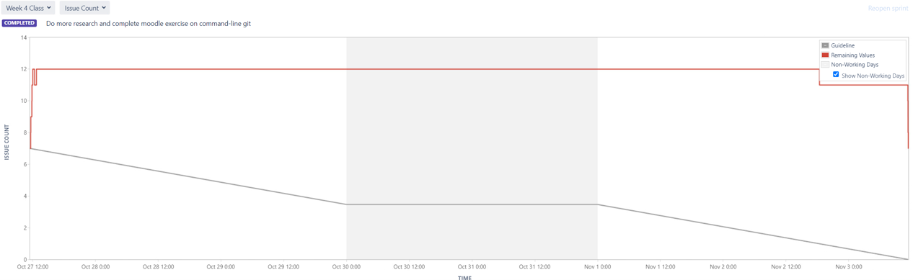
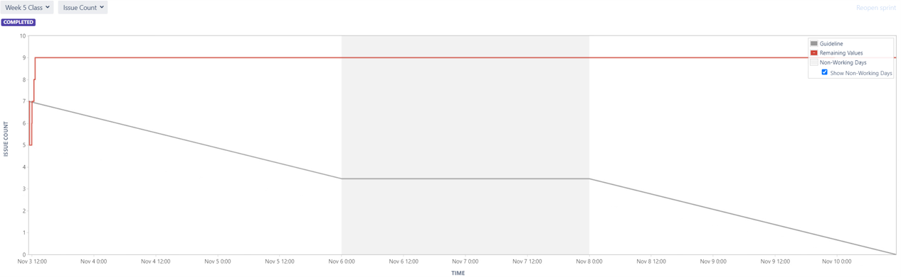
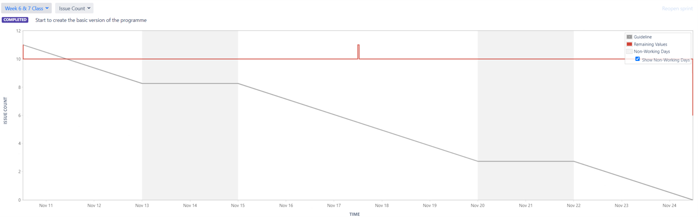
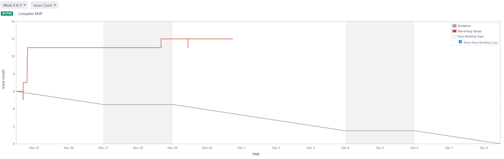
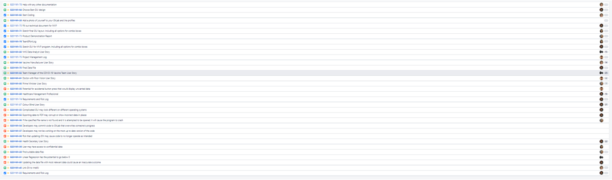
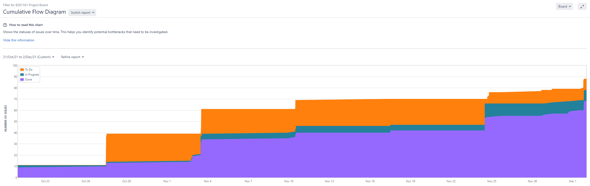

# Project Management Log
## Project management discussion

As a group of 6 we all had varying knowledge of both Java and project management tools before starting this project. We understood that some people would be more confident coding and others would prefer to focus more on documentation, and therefore we used that to our advantage when allocating tasks. Adam was assigned team leader as he had previous experience of managing a team product, however during the scrum meetings we had different scrum leaders each week to allow people to have an opportunity to lead development.

The team has worked well together thanks to our great communication, which was split between in person meetings and using a group chat to keep up to date. If anyone needed help or support, they were able to reach out and speak to another member of the team. This meant that the project kept progressing at a positive rate, and each week we had development in the complexity of our code. We were able to maintain a log of what was being worked on and what had been completed by using Jira. Here we could assign tasks to individuals and monitor progress, which made it clear if people needed some extra support.

As mentioned earlier we allowed everyone the opportunity to be scrum leader which meant everyone had the opportunity to lead the direction of the program. This was important as working as part of a team is about inclusion and allowing everyone to express themselves. The scrum meetings allowed us to monitor what needed to be done, what was in progress and what had been completed. From this we could always see if anyone needed some support from fellow team members. Looking back on our scrum meetings, it would have been beneficial to use all of Jira’s project management functions such as story points, estimated time completion and priority. This would have allowed us to use some of Jira’s charts to analyse and see what we were struggling with. This would have improved the efficiency of our team and allowed us to complete more in the same time.

Whilst we believe our communication as a group overall has been good, there are certainly issues and ways it could be improved. For example, we currently have a group chat where any questions can be asked or informing people of tasks to be completed. However, as people have other commitments, it can sometimes take a full day before getting a reply back. A suggestion that would improve this, is if we would have a second stand-up meeting later in the week. This would give everyone a dedicated time that could be used for asking questions, and collaborative working.

As a team we used weekly standups to keep the project moving in a positive direction. Some standups lasted more than one week as the content and tasks included were large and required more time. These stand ups were extremely useful in allowing us to discuss as a team what needs to be completed and how we can work as a team to do that. Below you can see our stand ups and what tasks where assigned each week:
* **Week 3** https://cseejira.essex.ac.uk/secure/RapidBoard.jspa?rapidView=5714&projectKey=B201161&view=reporting&chart=sprintRetrospective&sprint=3841 
* **Week 4** https://cseejira.essex.ac.uk/secure/RapidBoard.jspa?rapidView=5714&projectKey=B201161&view=reporting&chart=sprintRetrospective&sprint=3910
* **Week 5** https://cseejira.essex.ac.uk/secure/RapidBoard.jspa?rapidView=5714&projectKey=B201161&view=reporting&chart=sprintRetrospective&sprint=3967 
* **Week 6 & 7** https://cseejira.essex.ac.uk/secure/RapidBoard.jspa?rapidView=5714&projectKey=B201161&view=reporting&chart=sprintRetrospective&sprint=4036 
* **Weel 8 & 9** https://cseejira.essex.ac.uk/secure/RapidBoard.jspa?rapidView=5714&projectKey=B201161&view=reporting&chart=sprintRetrospective&sprint=4129 

## Sprint Burndown Charts

**Week 3:** 

**Stand-up Jira Link:** https://cseejira.essex.ac.uk/secure/RapidBoard.jspa?rapidView=5714&projectKey=B201161&view=reporting&chart=sprintRetrospective&sprint=3841 

**Week 4:**

**Stand-up Jira Link:** https://cseejira.essex.ac.uk/secure/RapidBoard.jspa?rapidView=5714&projectKey=B201161&view=reporting&chart=sprintRetrospective&sprint=3910

**Week 5:**

**Stand-up Jira Link:** https://cseejira.essex.ac.uk/secure/RapidBoard.jspa?rapidView=5714&projectKey=B201161&view=reporting&chart=sprintRetrospective&sprint=3967 

**Week 6 & 7:**

**Stand-up Jira Link:** https://cseejira.essex.ac.uk/secure/RapidBoard.jspa?rapidView=5714&projectKey=B201161&view=reporting&chart=sprintRetrospective&sprint=4036 

**Week 8 & 9:**

**Stand-up Jira Link:** https://cseejira.essex.ac.uk/secure/RapidBoard.jspa?rapidView=5714&projectKey=B201161&view=reporting&chart=sprintRetrospective&sprint=4129 

## Burndown-Charts Discussion

**Week 3:**
**Stand-up Jira Link:** https://cseejira.essex.ac.uk/secure/RapidBoard.jspa?rapidView=5714&projectKey=B201161&view=reporting&chart=sprintRetrospective&sprint=3841 
For the first week, a lot of tasks revolved around setting systems up for us to work together and a lot of admin duties. As a result of this you can see the issue count drops straight away, as the tasks are completed on the first day. You will also see how the issue count stays the same until the last day of the sprint. This is becasue even though the tasks were completed, it was not updated on Jira.

**Week 4:**
**Stand-up Jira Link:** https://cseejira.essex.ac.uk/secure/RapidBoard.jspa?rapidView=5714&projectKey=B201161&view=reporting&chart=sprintRetrospective&sprint=3910
This week shows the addition of more tasks to a point where we had 12 issues open. These issues were worked on throughout the week and it would seem from the graph it was left till the last days, however the issues were being worked on and then marked as complete before the next weeks sprint. There was still 6 tasks that were not completed, and moved over to the next weeks sprint. 

**Week 5:**
**Stand-up Jira Link:** https://cseejira.essex.ac.uk/secure/RapidBoard.jspa?rapidView=5714&projectKey=B201161&view=reporting&chart=sprintRetrospective&sprint=3967 
Similar to week 3, new tasks were added to the backlog and active sprint which is shown by the increase. One downfall of our team is that when we were completing the tasks we didnt update this on Jira so they issue count stayed the same. This week would make it seem we didn't complete any tasks but at the start of next week you will see a decline in the issue count.

**Week 6 & 7:**
**Stand-up Jira Link:** https://cseejira.essex.ac.uk/secure/RapidBoard.jspa?rapidView=5714&projectKey=B201161&view=reporting&chart=sprintRetrospective&sprint=4036 
As you can see at the start of this sprint some tasks are completed, a task is added mid week and another is completed. Then at the very end of the sprint we completed 5 tasks which reduced the number of tasks. 

**Week 8 & 9:**
**Stand-up Jira Link:** https://cseejira.essex.ac.uk/secure/RapidBoard.jspa?rapidView=5714&projectKey=B201161&view=reporting&chart=sprintRetrospective&sprint=4129 
Week 8-9 was our busiest week in terms of issue count, and you can see how we were constantly adding and completing new tasks. A lot of tasks were completed around 1st December when we were finishing our MVP program. There are still some uncompleted tasks but these refer to things that will be added to the program later, and doucmentation that still needed to be added.

In the future, our team need to make sure they are updated Jira with completed tasks so that the burndown chart can be more accurate. This will also allow us to issue more or less tasks depending on how much and how quick we get them done. Another issue we need to work on is making sure on Jira we use the estimated story points to utalise another burndown chart that Jira generates for us.

In order to improve the rate of tasks being completed over time, the groups completion of tasks must be faster which can be improved by reducing the difficulty of each task which may add more tasks but will take less time to complete. This can also be achieved by splitting big tasks down into smaller sub-tasks and spreading that out between multiple people.

## Product Backlog
This is our current backlog, as you can see most of the issues have actually been completed, and only a small number of issues need to be completed later on in the development of our program.

## Other Areas

Here you can see our cumulative flow diagram of our issues over time. As you can see over time we are completing tasks in a positive manner and making progress and we are always allocating new tasks to be completed. 

