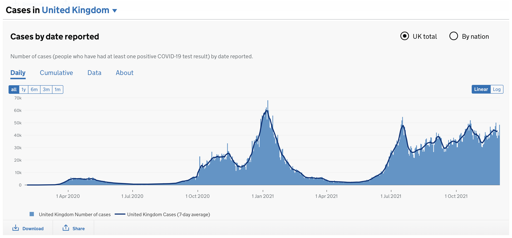

# Requirements and Risk Log

# Requirements

Here are 8 user stories which helped us to identify what the needs of a range of users are, and how we can achieve them. Each user story has been assigned to someone, and there will be an explenation of if the needs were met and how we achieved that. You will also see screenshots which display how the user stories have been met.

Doctor with Poor Vision User Story (https://cseejira.essex.ac.uk/projects/B201161/issues/B201161-81)
* As a doctor with poor vision, it is important that the layout of the GUI is clean and easy to distinguish between buttons, so that the data is not interpreted incorrectly.
* This story has been assigned to Aaran, who has made sure to meet the users needs by creating a clean, minimal GUI layout with space between each button to reduce the chance of accidental clicks.
* Screenshot:

Data Analyst User Story (https://cseejira.essex.ac.uk/projects/B201161/issues/B201161-80)
* As a data analyst for the NHS, it is important the data is visualised in different graphical forms, so that we can clearly identify trends and potential risks that could arise.
* This story has been assigned to Abdulquadri, who has completed the ideal outcome by creating a graph output that shows new cases, new deaths, cumulative cases and cumulative deaths visually, so trends can be identified. 
* Screenshots:

Team Manager User Story (https://cseejira.essex.ac.uk/projects/B201161/issues/B201161-82)
* As a team manager of the COVID-19 Vaccine team, it is important the program can forecast future cases, so that future demand can be predicted and adequate supply is ready.
* This story has also been assigned to Abdulquadri, who has completed the users needs by using linear regression to model and forecast cases and deaths up to 6 weeks in the future. This can be seen in the screenshots by the part in green.
* Screenshots:

Health Secretary User Story (https://cseejira.essex.ac.uk/projects/B201161/issues/B201161-83)
* As the health secretary, it is important that the graphs and other data representations are outputted to a PDF, so that it can be shared with other professionals or nations. 
* This story has been assigned to Adam, who has partly completed the users needs by taking all the raw data and outputting it to a table in a pdf when the button is selected. To improve this the graphs should also be added to the pdf in the future.
* Screenshot:

Vaccine Manufacturer User Story (https://cseejira.essex.ac.uk/projects/B201161/issues/B201161-84)
* As a vaccine manufacturer, it is important that the data be shown in a clear way and highlights rises in case, so that the manufacturing process can be done in time before the rise in both cases and deaths.
* This story has been assigned to Kieran, who has succesfully met the needs of the user by creating action listeners that change the display of the graph based on a combo box. This will allow the user to specify what information is displayed on the graph. 
* Screenshots:

Prime Minister User Story (https://cseejira.essex.ac.uk/projects/B201161/issues/B201161-85)
* As the prime minister, it is important the figures used are accurate and reliable to deaths and infections, as these will be used to make changes to the law that affect the public. 
* This story has been assigned to Victoria, who has completed the needs of the user by getting accurate data from the NHS website, and getting the program to read the data for use in the graphs.
* Screenshots:

Healthcare Management Professional (https://cseejira.essex.ac.uk/projects/B201161/issues/B201161-86)
* As a healthcare management professional, it is important that the data is portrayed in several different ways to make comparisons, so any change can be made.
* This story has been assigned to Adam, who has met the needs of the user by creating graphs to display new cases, total cases, new deaths, and total deaths. This will allow users to make comparisons. 
* Screenshots:

Colour Blind User Story (https://cseejira.essex.ac.uk/projects/B201161/issues/B201161-87)
* As someone who is colour blind, it is important the representations and visualisations are not colour dependant, and have the option to be updated to make them identifiable by someone who is colour blind. 
* This story has been assigned to Adam, however it has not yet been completed. It was not included in the MVP but it is something that will be developed further in the program to ensure the program is inclusive and accessible for all.

For futher requirement gathering, we have come up with both functional and non-functional requirements. These can be seen below:
| Functional Requirements | Non-Functional Requirements |
| ------ | ------ |
| Program must display data about COVID-19 infections and deaths in form of a graph | GUI Window should not exceed 1920x1080 |
| The data must come directly from the NHS website | Graph updates should not take more than 1 second |
| A GUI must display with buttons to change output | The program GUI should not be overfilled, and there should be room for more buttons |
| There must be an option to forecast the next 2,4, and 6 weeks | The NHS data should not be able to be altered to protect accuracy |
| Must be able to be exported to PDF | The program should be scalable for more data each day on COVID-19 infections and deaths |
| Use Linear Regression to model data | The algorithms should be efficient so the program is compatible with most machines |
| Accessible view for colour blind users | The program must meet all Data Protection and GDPR laws |
| Ability to highlight points or search for a point | PDF output will be to standard A4 size in portrait |

## Risk Log

Below are 10 risks we came up with as a team that we made sure to think about in the development of our code. These risks have the potential to break the code or make the output invalid, therefore it was really important that during the development we came up with ways to mitigate or minimise the risk exposure.

Risk 1 (https://cseejira.essex.ac.uk/projects/B201161/issues/B201161-89)
* **Risk Description:** Updating the data file with most relevant data could cause an inaccurate outcome
* **Risk Summary:** When new data is added to the .csv file, if anything is added incorrectly this will cause the program to give inaccurate results.
* **Assigned to:** This risk was assigned to Adam, the risk has been mitigated as much as possible by adding title headings to the .csv file
* **Jira Comments:** Updating data could cause an inaccurate result if it is not added correctly. To mitigate this risk, title headings have been added to the .csv file in an attempt to make sure it is understood what is needed in each field.

Risk 2 (https://cseejira.essex.ac.uk/projects/B201161/issues/B201161-90)
* **Risk Description:** Potential for accidental button press that would display unwanted data
* **Risk Summary:** If the buttons are placed too close together then the user may miss-click and select an incorrect option
* **Assigned to:** This risk was assigned to Aaron, who was able to minmise the potential risk by making sure there was adequate spacing between buttons.
* **Jira Comments:** Aaran has mitigated the risk as much as possible by leaving space between each button and by making the buttons large in size.

Risk 3 (https://cseejira.essex.ac.uk/projects/B201161/issues/B201161-91)
* **Risk Description:** Linear Regression has the potential to go below 0
* **Risk Summary:** Due to how the algorithm works, there is the potential for linear regression to show a negative value which is not possible for number of deaths. This would significantly discredit the reliability of our program.
* **Assigned to:** 
* **Jira Comments:** 

Risk 4 (https://cseejira.essex.ac.uk/projects/B201161/issues/B201161-92)
* **Risk Description:** Exporting data to PDF may corrupt or show incorrect data in places
* **Risk Summary:** If the code for writing to PDF is not correct it could cause invalid data entries and mean the output is no longer reliable.
* **Assigned to:** This risk was assigned to Adam, who has mitigated this risk by using a 3rd party library to minimise the amount the data needs to be handled. 
* **Jira Comments:** 

Risk 5 (https://cseejira.essex.ac.uk/projects/B201161/issues/B201161-94)
* **Risk Description:** Complicated GUI may look different on different operating systems
* **Risk Summary:** If there are many components and features to the GUI it may not look the same across different operating systems. This could cause some features to not work as intended.
* **Assigned to:** This risk was assigned to Adam, who attempted to reduce this risk by keeping the overall layout and components used in the GUI simple.
* **Jira Comments:** The overall design of the GUI has been left minimal and only basic components have been used to attempt to keep display the same across all devices/operating systems

Risk 6 (https://cseejira.essex.ac.uk/projects/B201161/issues/B201161-95)
* **Risk Description:** Developers may commit code to GitLab that overwrites someone's progress
* **Risk Summary:** If two people are working on code at the same time and they both commit to GitLab and choose to overwrite any existing code, this may cause people to lose work they have developed.
* **Assigned to:** This risk is responsible to the whole team, it is important that the team is constantly communicating so that no code is lost.
* **Jira Comments:** As a team, we made sure to keep in constant communication by using group chats. We made sure to let everyone know when we committed new code, and understood the steps needed to only commit relevant changed files.

Risk 7 (https://cseejira.essex.ac.uk/projects/B201161/issues/B201161-96)
* **Risk Description:** If the specified file name is not found and it is attempted to be opened, it will cause the program to crash
* **Risk Summary:** Attempting to read a file that doesn't exist will cause the program to crash with an exception
* **Assigned to:** This risk was assigned to Victoria who made sure to eliminate the risk by using code to stop the program crashing.
* **Jira Comments:** When the file attempts to be read into an array, it is surrounded in a "try, catch" statement that will stop the program from crashing if the file is not found

Risk 8 (https://cseejira.essex.ac.uk/projects/B201161/issues/B201161-97)
* **Risk Description:** User may have access to confidential data
* **Risk Summary:** If a large data set is used this may give the user access to some irrelevant confidential data
* **Assigned to:** This risk was allocated to Carol, who made sure the .csv file was opened as read only so that it couldnt be altered. 
* **Jira Comments:** To stop users having the opportunity to rewrite or append to the data, the file will be opened as a read only file. Thus preventing any possible changes. 

Risk 9 (https://cseejira.essex.ac.uk/projects/B201161/issues/B201161-98)
* **Risk Description:** Developers may not be working on the most up to date version of the code
* **Risk Summary:** If developers do not regularly pull from GitLab then the code they're using may no longer be up to date, and significant changes may have already been made
* **Assigned to:** This risk is the responsibility of the whole team, using group chats and regularly checking GitLab to check if there are any new commits.
* **Jira Comments:** As a team, we used a group chat to keep others updated when a new commit was made. This meant everyone knew they had to pull from GitLab to get the newest version.

Risk 10 (https://cseejira.essex.ac.uk/projects/B201161/issues/B201161-99)
* **Risk Description:** Risk that updating JDK may cause code to no longer operate as intended
* **Risk Summary:** When updating the JDK it is possible that this will cause areas of the code to no longer function.
* **Assigned to:** This risk is also assigned to the whole team, as we need to keep up-to-date with all changes to JDK and iText librarys for changes that may affect the code.
* **Jira Comments:** Our code does not use too many complicated methods or features. However it does use third party libraries, the only way we can reduce this risk is by keeping informed and up-to-date with any changes to JDK versions or updates to the iText library
